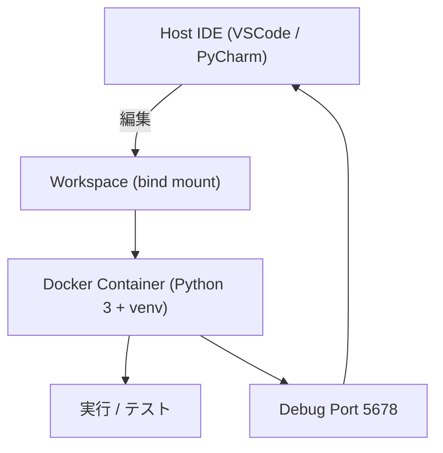

# Python コンテナ開発テンプレート

Docker 内だけで動作する最小の Python テンプレートです。
依存はイメージ内にインストールし、ソースコードはホストから bind mount します。

## 前提

- Docker / Docker Compose が使えること
- Python はコンテナ内のみで使用

## 使い方

docker compose を直接使う場合は、ホストUID/GIDを環境変数に設定してください。

```bash
export UID="$(id -u)"
export GID="$(id -g)"
```

## 構成イメージ



## イメージのビルド

```bash
docker compose -f compose.yml build
```

## テスト

```bash
docker compose -f compose.yml run --rm python pytest -q
```

- `make test` では実行ログを `logs/test.log` に保存します

## 実行

```bash
docker compose -f compose.yml run --rm python python src/app.py
```

## デバッグ

```bash
docker compose -f compose.yml run --rm --service-ports python-debug
```

- コンテナ側は `5678` で待ち受けます
- IDE から `localhost:5678` に Attach

## Makefile

```bash
make help
```

## 注意

- `requirements.txt` を唯一の依存定義にします
- `.venv` はイメージに含めます（依存変更時は再ビルド）

## ディレクトリ構成

```
PythonExample/
├── src/
│   ├── app.py
│   └── resources/
│       └── config.json
├── tests/
│   └── test_app.py
├── requirements.txt
├── docker/
│   └── Dockerfile
├── compose.yml
├── logs/
├── Makefile
└── README.md
```

## bind mount

- `.` -> `/workspace`（コード・設定・テスト）
- `./logs` -> `/workspace/logs`（テストログ）
